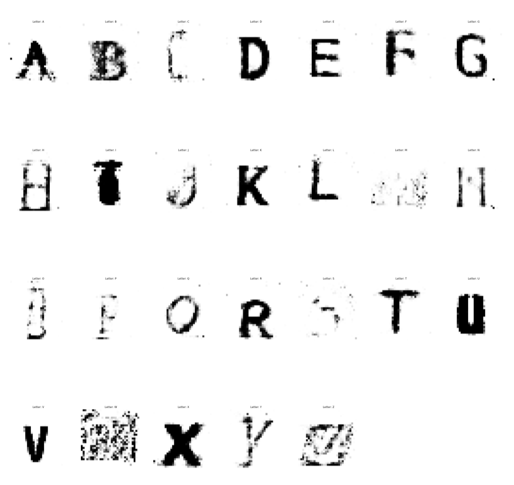
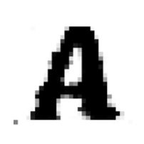
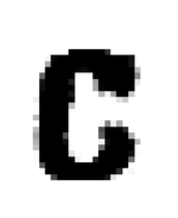
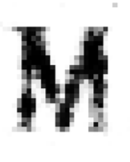
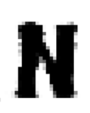

# FontDetector
FontDetector is an end-to-end system which classifies handwritten characters using a deep convolutional neural networks(DCNN).

## Introduction
A tensorflow(keras) implementation of handwritten digit recognition and generation.
<div float="left">
  
  
</div>
<div float="right">
</div>

## Getting Started
To run this repo, be sure to install the following environment and library:

1. Python 3.6
2. Tensorflow=1.12.0
3. Keras=2.2.0
4. Pandas=0.20.3
5. Numpy=1.13.3
6. h5py=2.7.0

## Installation
```python
pip install FDCNN
```


## File Illustration
This repo is divided into 3 directories.
 1. The `model` directory contains all codes and jupyter notebooks.
 2. The `Data/` directory is place where data is in.
 3. The `results/` directory contains all results plots, Logs and etc.

#### There are currently three different models:
1. CGAN.py (Conditional-GAN)
2. GAN.py (Generative Adversarial Network)
3. CNN.py (DCNN)

#### The results are plotted in:
1. sample_new_char.ipynb (or results/CGAN_Adam/figs/letters/)
2. sample_new_sentence.ipynb (or results/CGAN_Adam/figs/sentence/)
3. results/CGAN_Adam/Logs/
4. results/CNN/Logs/
5. results/CNN/figs/

### Run
To run the prediction model, select one of the model. For instance, 
```
python CGAN.py
```
To run iPython file, you need to run jupyter notebook
```
jupyter notebook
```

### Input & Output & Loss
The input consists of a big list of handwritten characters images with 9000 different fonts.
The output of CNN is detected character given an image, output of CGAN & GAN is new generated character or sentence.
The input images are scaled between [-1, 1] using normalization.
The Loss functions defined for CNN are Mean Absolute Error (MAE), Mean Squared Error (MSE), Categorical CrossEntropy.
The Loss functions defined for CGAN & GAN are Mean Absolute Error (MAE), Binary CrossEntropy.

### Hyper-parameters
|Model | #Layers  |  Activation    |  Optimizer  | Batch_size | LR | n_epochs |
|----------| ------------- |------|-------| -----| --------| ------|
|   CNN    | 5       | ReLU       |    Adam     | 256 | 0.0001 | 500 |
|   GAN    | 3+5       | Leaky ReLU       |    Adam+SGD     | 256 | 0.0002+0.01 | 250 |
|   CGAN    | 3+5       | Leaky ReLU       |    Adam+SGD     | 256 | 0.0002+0.01 | 100 |


## Sample Results

<div align="center">
	
</div>

### Inception Score
|Character A|Character C|Character M|Character N|
|:------------:|:------------:|:------------:|:------------:|
|||||
|inception score:<br/> mean:2.148760 </br> stddev:0.21655125|inception score:<br/> mean:2.116231 </br> stddev:0.27043255||inception score:<br/> mean:2.197126 </br> stddev:0.203367|inception score:<br/> mean:2.169014 </br> stddev:0.0196410|

